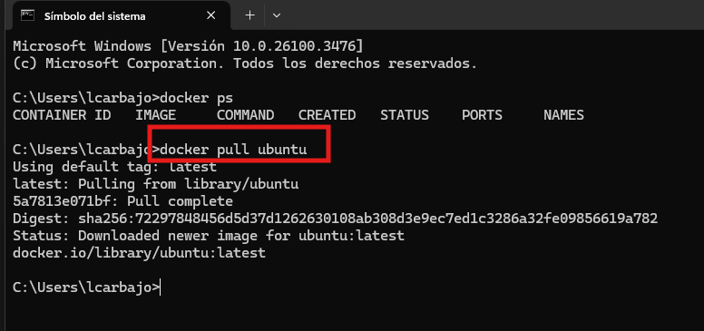
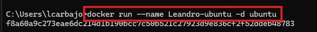
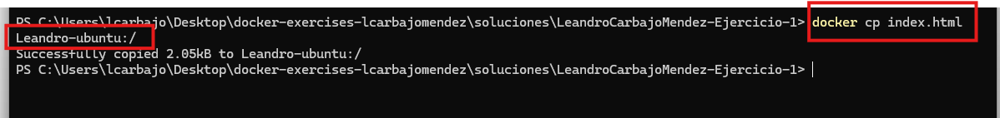
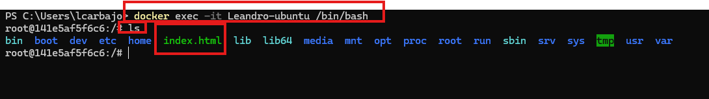
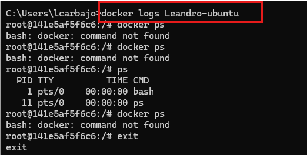

## Solución

Antes de comenzar con la tarea, debemos instalar `docker` y para ello he seguido esta guía de instalación `https://docs.docker.com/engine/install/ubuntu/` para la máquina virtual. Sin embargo, se nos ha dicho que usemos `Docker Desktop` por lo que he decidido instalar este.

1. Utilizar el comando que nos permite bajarnos una imagen para tenerla en local. La selección de la imagen os la dejo a vosotros. 
   
    >[!TIP] Recomendación.
    Estaría muy interesante que uséis [dockerHub](https://hub.docker.com/), un repositorio público de imágenes y seleccionarais una que os guste. Pero si no sabéis usar una llamada 'ubuntu'. La idea es que exploreis.

   El comando usado es `pull` y tras este le añadimos el nombre de la foto que deseamos descargar por nuestra parte, en mi caso he querido hacerla de ubuntu como dice el ejemplo. 

   

2. Obtenido la imagen, desplegar el contenedor con la nomenclatura  `<vuestro nombre>-<nombre imagen>`.

   Para desplegar el contenedor he utilizado el comando:

   ```bash
   docker run --name Leandro-ubuntu -d ubuntu
   ```
   Donde `run` nos creará el contendor, si añadimos a este `--name` podremos darle un nombre a nuestro contenedor, con el `-d` ejecutamos el contenedor en segundo plano y por último añadimos el nombre de la imagen creada anteriormente.  

    

3. Usar el comando para listar las imagenes.

   ```bash
   docker images
   ```
   Usaremos `docker images` para poder mostrar todas las imágenes que tenemos.

    

4. Usar el comando para listar los contenedores y su estado.

   ```bash
   docker ps -a
   ```
   El comando usado en mi caso para listar los contenedores y ver su estado ha sido `docker ps -a` monstrando todo los contenedores (tanto en ejecución como parados).

5. Crea en tu ordenador un fichero llamado "index.html" y copialo dentro del contenedor, con el comando correspondiente

   ```bash
    docker cp index.html Leandro-ubuntu:/
   ```
   El comando `cp` nos permite copiar los archivos, añadiendo posteriormente el nombre del archivo y el nombre del contenedor desde la raíz.

   

6. Usar el comando que os permita meteros por consola al contenedor y verificar que el archivo fue copiado con éxito. Luego, haced cualquier otro comando. Me sirve cualquiera.

   En mi caso me estaba dando error a la hora de conectar por lo que tuve que crear otro contenedor, tras esto lo he iniciado con el comando 

   ```bash
    docker start Leandro-ubuntu
   ```
   Luego a ello, he realizado el comando para poder entrar en la consola y poder verificar si se encuentra el archivo.

   ```bash
    docker exec -it Leandro-ubuntu /bin/bash
   ```
   Para observar si se encuentra el archivo he decidido usar `ls` permitiendo encontrarlo.

   

7. Consultar los logs del contenedor, con el comando que corresponda

   Cuando realizamo el comando `log` nos aparecerá el conjunto de log que posee el contenedor.

   


8. Eliminar el contenedor.

   ```bash
   docker rm Leandro-ubuntu
      ```

   Con este comando eliminaremos el contenedor cuyo id hemos añadido.

   


9. Eliminar la imagen de vuestro registry local.

   ```bash
   docker rmi ubuntu
      ```

   Con este comando eliminaremos la imagen que hemos usado para nuestro contenedor añadiendo el id de esta para eliminarlo.


   
