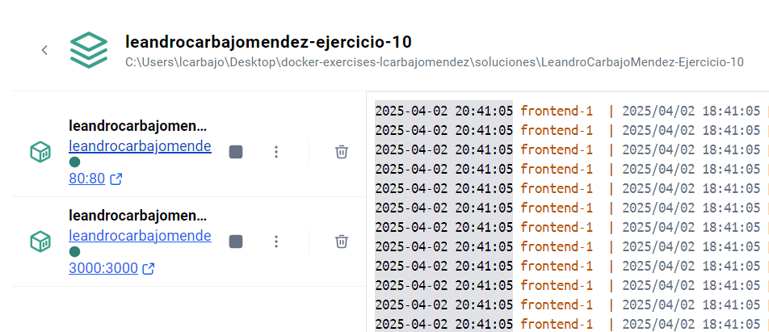
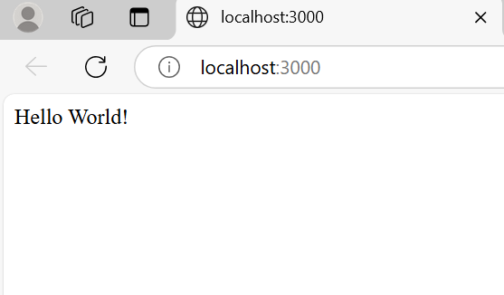

# Ejercicio 10 - Docker-compose

## Objetivos
- Creación de contenedores a través de un docker-compose.
- Manejo de redes y volúmenes en un docker-compose.
- DNS en contenedores.

## Consideraciones

En la carpeta `soluciones` se creará una carpeta con el siguiente formato `<vuestro nombre>-Ejercicio-10`, donde se incluirán los archivos generados, capturas del proceso de construcción y verificación, y un archivo `README_ej10.md` con las explicaciones de los pasos realizados.

## Tarea
Volver al proyecto dado de ejemplo para el Ejercicio 4. Ejecutarlo nuevamente, pero ahora aplicando todo lo aprendido sobre docker-compose. En cuanto al frontend, usar la imagen en la que se hizo multistage. Hacer que las imágenes se creen en el momento de ejecutar el docker-compose. Prestar atención a volúmenes y redes, si fuera necesario crearlos. 

Creamos el archivo `docker-compose.yml` con el siguiente contenido:

```bash
version: '3.8'

services:
  frontend:
    build:
      context: ./ui-web
      dockerfile: Dockerfile
    ports:
      - "80:80"
    networks:
      - app-network

  backend:
    build:
      context: ./api-web
      dockerfile: Dockerfile
    ports:
      - "3000:3000"
    networks:
      - app-network

networks:
  app-network:
    driver: bridge
```
En el archivo `docker-compose.yml` se indica que se deben crear dos servicios, `frontend` y `backend`, a partir de los contextos `./ui-web` y `./api-web` respectivamente. Se indica que se deben mapear los puertos 80 y 3000 de los contenedores a los puertos 80 y 3000 del host. Se crea una red llamada `app-network` con el driver `bridge`. Con todo ello, se pueden crear los contenedores y ejecutar el proyecto.

A raíz del archivo denominado `docker-compose.yml`, utilizamos el siguiente comando para crear los contenedores:

```bash
docker-compose up --build
```


Muestra de resultados a la hora de ejecutar el comando `docker-compose up --build`:






- Ambos contenedores, para comunicarse entre sí, ¿usan el puerto interno propio de la red o el puerto desde el que nosotros accedemos a ellos desde nuestra PC?

    Los contenedores se comunican entre sí usando el puerto interno propio de la red de Docker, no desde el puerto desde el que nosotros accedemos a ellos desde nuestra PC. En mi caso, los servicios frontend y backend están conectados a la misma red app-network, lo que les permite comunicarse entre sí utilizando los nombres de los servicios y los puertos internos.

    A través del siguiente comando, podemos ver los puertos internos de los contenedores:

    ```bash
    docker network ls
    ```

    

- ¿Qué otro valor (más humanamente reconocible y de carácter permanente) puede ser usado en lugar de las IPs internas de los contenedores a la hora de comunicarlos entre sí?

    Los contenedores pueden comunicarse entre sí utilizando los nombres de los servicios y los puertos internos. Esto es más humanamente reconocible y de carácter permanente que las IPs de los contenedores. Por ejemplo, en lugar de usar la IP `172.19.0.2` para acceder al servicio backend, puedo usar el nombre del servicio `backend` y el puerto `3000`. En mi supuesto, al no estar configurado nos saldrá `Cannot GET /api/endpoint` teniendo que modificar el archivo `index.js` para que se pueda acceder a los servicios de backend.


