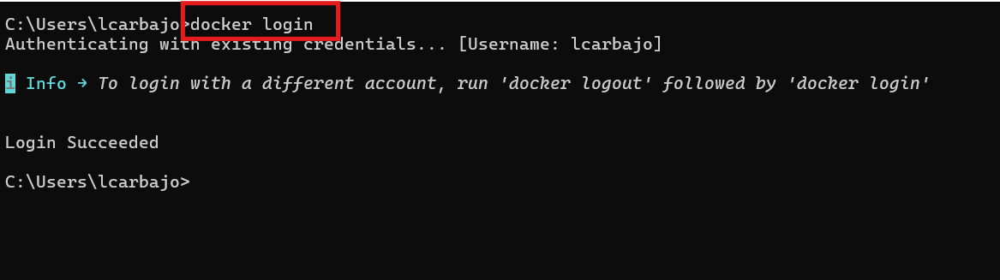
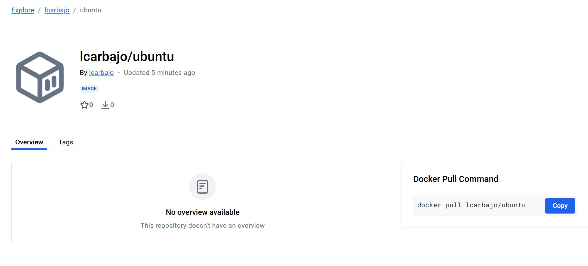

# Ejercicio 3 - Retagging y Push de Imágenes a DockerHub
## Objetivo 
Aprender a retaggear una imagen de Docker y subirla a tu cuenta personal de Docker Hub.

## Consideraciones
 1. En la carpeta `soluciones` se creará una carpeta con el siguiente formato  `<vuestro nombre>-Ejercicio-3`.
 2. En esa carpeta se dejará el dockerfile creado y en un archivo llamado `README_ej03.md` con los comandos utilizados con sus salidas por pantalla.

## Tarea
1. Retaggea la imagen descargada en el Ejercicio 1. Respeta el formato correspondiente. Define un número de versión.

    Para la realización de este apartado debemos usar el comando, el cual es el siguiente nos permite añadir una nueva etiqueta a una imagen existente:

    ```bash
    docker image tag nombre_imagen:version nuevo_nombre:versión 
    ```

    

2. Sube la imagen a tu cuenta propia en el registry de Docker.

    Empezamos con el login en docker, siendo mi caso automático sin necesidad de añadir usuario y contraseña, aunque lo normal es que te pida estos elementos. 

    Para ello usamos: 

    ```bash
    docker login 
    ```
    

    Tras logearnos, realizamos un `push` a la imagen que queremos subir y esperamos a que finalice.

    ```bash
    docker push lcarbajo/ubuntu:latest
    ```
    

3. Verificar la Imagen en Docker Hub.

    Una vez subida, nos situamos en la página oficial para poder buscar nuestra imagen propia en su repositorio.

     

4. Adjunta capturas de todo el proceso .


