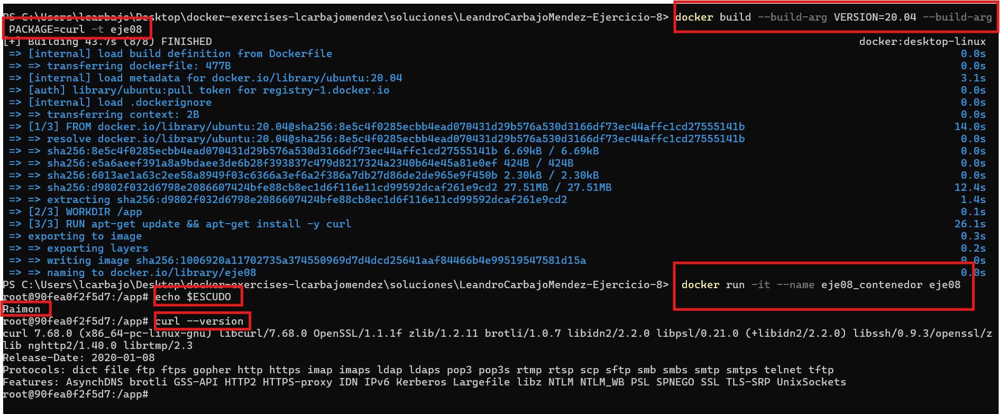

# Ejercicio 8 - Dockerfile con ARG y ENV

## Objetivos

Aprender a utilizar las instrucciones `ARG` y `ENV` en un `Dockerfile` para configurar una imagen de Docker y gestionar variables de entorno y argumentos en el momento de la construcción.

## Consideraciones

En la carpeta `soluciones` se creará una carpeta con el siguiente formato `<vuestro nombre>-Ejercicio-8`, donde se incluirán el `Dockerfile`, capturas del proceso de construcción y verificación, y un archivo `README_ej08.md` con las explicaciones de los pasos realizados.

## Tarea

**Instrucciones a seguir para crear el `Dockerfile`:**

   - Definir una variable de entorno utilizando `ENV`, la cual será accesible dentro del contenedor en tiempo de ejecución.

        En mi Dockerfile he añadido una variable de entorno llamada `ESCUDO` con el valor `Raimon`.

   - Utilizar la instrucción `ARG` para recibir un argumento en el momento de la construcción de la imagen. Este argumento permitirá la instalación de un paquete (a elección) en el contenedor.

        Para ello, he definido un argumento llamado `PAQUETE` que se utilizará para instalar un paquete llamado `curl` en el contenedor y tambien un argumento llamado `VERSION` que se utilizará para instalar una versión específica de `ubuntu`.

   - Crear la imagen y el contenedor. Verificar que la variable de entorno esté disponible y que el paquete haya sido instalado. Adjuntar capturas de todo el proceso.

        1. Primero, monstrar mi Dockerfile:

            ```bash
            # Definir el argumento para la versión de Ubuntu
            ARG VERSION=latest

            # Usar una imagen base de Ubuntu
            FROM ubuntu:${VERSION}

            # Definir una variable de entorno
            ENV ESCUDO="Raimon"

            # Establecer el directorio de trabajo
            WORKDIR /app

            # Recibir un argumento para el paquete a instalar
            ARG PACKAGE

            # Instalar el paquete especificado
            RUN apt-get update && apt-get install -y ${PACKAGE}

            # Comando por defecto
            CMD ["bash"]
            ```
        2. Luego, construir la imagen con los argumentos oportunos:

            ```bash
            docker build --build-arg VERSION=20.04 --build-arg PACKAGE=curl -t eje08 .
            ```

        3. Levantar el contenedor:

            ```bash
            docker run -it --name eje08_contenedor eje08
            ```

        4. Ejecutar comandos para ver las variables de entorno y el paquete instalado para verificar que todo esté funcionando correctamente:
        
            ```bash
            echo $ESCUDO
            curl --version
            ```

        5. Mostrar todo:
            