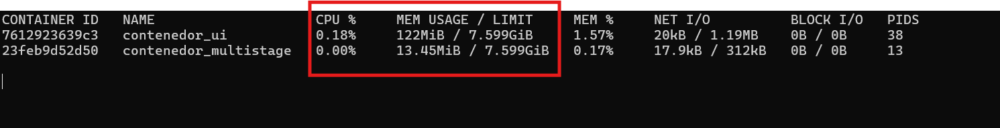

# Ejercicio 9 - Multistage

## Objetivos
- Entendimiento de qué es Multistage.
- Creación del primer Multistage.
- Comparación en el consumo de recursos de un contenedor con y sin Multistage.

## Consideraciones
 Multistage permite crear imágenes optimizadas y más pequeñas al dividir el proceso de construcción de imágenes en varias etapas dentro de un solo Dockerfile. Cada etapa puede usar una imagen base diferente, y los artefactos (por ejemplo, binarios o archivos compilados) de una etapa se pueden copiar a una etapa posterior. Esto ayuda a evitar que las herramientas de compilación y otros archivos innecesarios queden en la imagen final. 
 
En la carpeta `soluciones` se creará una carpeta con el siguiente formato `<vuestro nombre>-Ejercicio-9`, donde se incluirán el `Dockerfile`, capturas del proceso de construcción y verificación, y un archivo `README_ej09.md` con las explicaciones de los pasos realizados.

## Tarea
1. Reusar el proyecto frontend del Ejercicio 4 (carpeta "ui-web") y crear un nuevo Dockerfile usando la funcionalidad de Multistage. Crear la imagen y el contenedor (atención a los puertos).

    Iniciamos este apartado mostrando nuestro Dockerfile para la funcionalidad de Multistage:

    ```bash
    #ETAPA 1
    #Constructor de la aplicación
    FROM node:14 AS build
    
    #Establecer el directorio de trabajo
    WORKDIR /app
    
    #Copiar los archivos de dependencias
    COPY package*.json ./
    
    #Copiar el resto del código fuente
    COPY . .

    #Instalar todas las dependencias
    RUN yarn install

    #Construir la aplicación para producción
    RUN yarn run build
    
    #ETAPA 2
    #Imagen de producción
    FROM nginx AS production
    
    #Establecer el directorio de trabajo
    WORKDIR /app
    
    #Copiar solo los archivos necesarios desde construcción
    COPY --from=build /app/dist /usr/share/nginx/html
    
    #Exponer el puerto en el que la aplicación se ejecutará
    EXPOSE 80
    ```
    Como observamos, el Dockerfile consta de dos etapas: la primera etapa se utiliza para construir la aplicación y la segunda etapa se utiliza para crear la imagen de producción. En la primera etapa, se utiliza la imagen de Node.js 14 como base y se copian los archivos de dependencias y el código fuente. Luego, se instalan las dependencias y se construye la aplicación para producción. En la segunda etapa, se utiliza la imagen de Nginx como base y se copian solo los archivos necesarios desde la primera etapa. Finalmente, se expone el puerto 80 para que la aplicación se ejecute.

    Una vez creado el Dockerfile, podemos construir la imagen y el contenedor utilizando los siguientes comandos:

    ```bash
    docker build -t multistage .
    ```
    
    

     ```bash
     docker run -d -p 5173:80 --name contenedor_multistage multistage
    ```
    

    Si todo ha salido correcto nos mostrará lo siguiente:

    

2. Levantar el contenedor de la imagen original, creada en el ejercicio4.

    Iniciamos este apartado mostrando nuestro Dockerfile del ejercicio 4

    ```bash
    # Usa una imagen base de Node.js
    FROM node:14

    # Establece el directorio de trabajo
    WORKDIR /app

    # Copia los archivos de proyecto
    COPY package*.json ./

    # Instala las dependencias
    RUN yarn install

    # Copiar el resto de archivos del proyecto
    COPY . . 

    # Expone el puerto que usará la aplicación
    EXPOSE 5173

    # Comando para iniciar la aplicación
    CMD ["yarn", "dev", "--host"]
    ```
    En este Dockerfile, se utiliza la imagen de Node.js 14 como base y se copian los archivos de dependencias y el código fuente. Luego, se instalan las dependencias y se expone el puerto 5173 para que la aplicación se ejecute. Finalmente, se ejecuta el comando `yarn dev --host` para iniciar la aplicación.

    Para crear la imagen, podemos utilizar el comando:
    
    ```bash
    docker build -t ui_web .
    ```
    

    Tras esto, podemos ejecutar el contenedor con el comando:

    ```bash
    docker run -d -p 5000:5173 --name contenedor_ui ui_web
    ```
    

    Si todo ha salido correcto nos mostrará lo siguiente:
    
    


3. Comparar el uso de recursos de ambos contenedores (Ayuda: ejecutar comando "docker stats" o a través de la aplicación Docker Desktop en Windows).

    Para comparar el uso de recursos de ambos contenedores, podemos utilizar el comando `docker stats` o la aplicación Docker Desktop en Windows. Primero, ejecutamos el comando `docker stats` para obtener la información de uso de recursos de los contenedores mostrádonos el siguiente resultado:

    

    Como podemos observar , el contenedor `contenedor_ui` utiliza más recursos que el contenedor `contenedor_multistage` debido a que el contenedor `contenedor_ui` utiliza una imagen de `Node.js 14` como base y copia todos los archivos del proyecto, mientras que el contenedor `contenedor_multistage` usa una imagen `Ngix` como base y copia solo los archivos necesarios para la aplicación. Esto hace que el contenedor `contenedor_multistage` sea más eficiente en términos de uso de recursos.
